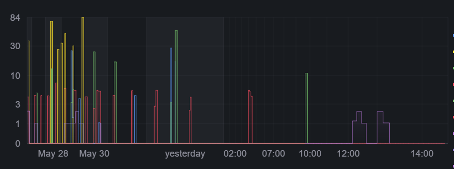
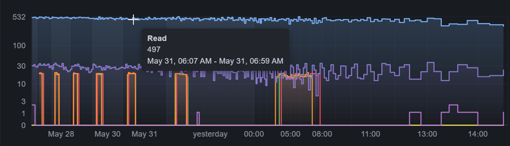
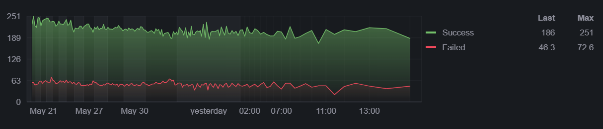

# Horizon Panel

`myrspoven-horizon-panel` is a Grafana panel plugin for time series where the recent past needs much more screen space than older history.

It renders a continuous nonlinear time axis using a `log1p(age)` projection: recent data stays detailed, older data is progressively compressed, and the chart keeps enough historical context to make shifts and baseline changes visible on passive operational dashboards.



## Features

- Continuous nonlinear X-axis with current time at the right edge.
- Automatic screen-space aggregation, so older compressed history is grouped into larger real-time buckets.
- Multiple numeric time series from Grafana data frames, including Prometheus query results.
- Configurable aggregation mode: max or average.
- Linear or signed `log1p` Y-axis.
- Optional Y-axis lower bound at zero or the smallest visible series value.
- Hourly vertical markers for the current day and daily markers for older history.
- Optional collision-aware X-axis labels with hours for the last range day and day labels for older history.
- Alternating day background bands for easier temporal scanning.
- Grafana field color overrides with palette fallback.
- Legend display and ordering, line width, line opacity, fill opacity, gradient mode, line style, null connection, point visibility, stacking, and common Grafana TimeSeries field override options.
- Grafana field thresholds rendered as optional dashed threshold lines.
- Clickable legend rows for temporarily showing or hiding series.
- Hover tooltips with the bucket interval and formatted series value.
- Drag-to-zoom, Shift-drag pan, Ctrl-wheel zoom, and Y-axis click toggling between linear and compressed `log1p` scale.
- Optional Ctrl-click Explore links built from a multiline Grafana Explore `left` JSON object.

## Screenshots





## Status

This plugin is early and currently optimized for operational throughput/count dashboards. The rendering model is intentionally experimental, so expect visual behavior and option names to evolve before a stable public release.

## Requirements

- Node.js 22 or newer.
- npm 10 or newer.
- Docker, for the local Grafana development server.
- Grafana 9.2.0 or newer.

## About Myrspoven

[Myrspoven](https://myrspoven.com/) builds AI-driven energy optimization software for smarter, more sustainable buildings. The company focuses on commercial real estate and uses dynamic building control to reduce energy consumption, lower emissions, and make buildings more responsive to factors such as occupancy, weather, energy tariffs, and grid needs.

Myrspoven was founded in Stockholm in 2017 at the intersection of energy engineering and information technology. Its public vision is to help the global real estate industry reduce the carbon footprint of non-renewable energy use by 1%, using AI and data analytics to turn buildings into more dynamic assets in the modern energy system.

## Development

Install dependencies:

```bash
npm install
```

Run the checks used by CI:

```bash
npm run ci
```

Build the plugin:

```bash
npm run build
```

Start a local Grafana instance with the plugin and provisioned demo dashboard:

```bash
npm run server
```

Then open [http://localhost:3000](http://localhost:3000). The default development credentials from the Grafana plugin scaffold are `admin` / `admin`.

For faster frontend iteration, run the webpack watcher in a second terminal:

```bash
npm run dev
```

## Using the Panel

Add the **Horizon** visualization to a Grafana panel and query any data source that returns a time field plus one or more numeric fields. Prometheus range queries work through Grafana's normal data frame pipeline.

Useful options:

- The Grafana dashboard time range controls how far back the panel renders data.
- **Compression focus** controls how much recent time receives the most horizontal space.
- **Aggregation** chooses max or average for automatic buckets.
- **Y-axis scale** switches between linear and `log1p`.
- **Y-axis lower bound** keeps the baseline at zero or at the visible series minimum. Grafana's standard field **Min** and **Max** settings act as hard y-axis bounds when configured.
- **Palette** controls fallback colors when Grafana field colors are not set.
- **Legend** hides the legend or places it on the right or bottom.
- **Legend order** keeps query order, sorts alphabetically, or sorts by last value and then max value.
- **Show X-axis labels** toggles hourly and daily labels on the nonlinear timeline.
- **Day band brightness** tunes the alternating background stripe intensity.
- **Show tooltip** toggles hover details.
- **Drag to zoom** enables drag zoom, Shift-drag pan, Ctrl-wheel zoom, and Y-axis click scale toggling.
- **Explore left JSON** defines the Grafana Explore `left` object used for Ctrl-click drilldown links. The panel constructs `/explore?left=...` and expands variables such as `${fromIso}`, `${toIso}`, `${seriesRaw}`, and `${valueRaw}`.
- Graph styling such as line interpolation, line style, line width, line opacity, fill opacity, gradient mode, connect null values, show points, stack series, and threshold display is configured through Grafana field defaults or field overrides.

Series-specific colors are configured with Grafana field overrides: add an override for a field, choose **Standard options > Color scheme**, and set a single color. Decimal settings are used for legend and threshold labels, and a shared unit is shown as a Y-axis label. Thresholds use Grafana's standard field threshold editor. Field defaults and overrides also support TimeSeries-style settings such as draw style, line interpolation, line width, fill opacity, gradient mode, line style, connect null values, show points, point size, stacking, soft axis bounds, and negative-Y transform where they fit the nonlinear renderer.

Legend clicks hide or show a series within the panel. This is local display state and does not change the Grafana query.

## Installing from a Release ZIP

Download the release ZIP for the plugin version you want, then extract it into your Grafana plugin directory and restart Grafana.

Example:

```bash
unzip myrspoven-horizon-panel-0.0.1.zip -d /var/lib/grafana/plugins
sudo systemctl restart grafana-server
```

The ZIP contains the plugin directory itself. After restart, Grafana should find `myrspoven-horizon-panel`.

Unsigned plugins are not loaded by default in production Grafana. Until the plugin is signed or published in the Grafana plugin catalog, local/private Grafana instances must explicitly allow it:

```bash
GF_PLUGINS_ALLOW_LOADING_UNSIGNED_PLUGINS=myrspoven-horizon-panel
```

## Publishing in the Company GitHub Organization

This repository is intended to live under the Myrspoven GitHub organization once it is ready for broader use. After moving the repository, update the repository metadata in `package.json`, the repository and issue links in `src/plugin.json`, and any GitHub Actions environment or secret configuration that is scoped to the old private repository.

Recommended organization setup:

- Repository name: `myrspoven-horizon-plugin`.
- Default branch: `main`.
- Required repository secret for signed release builds: `GRAFANA_ACCESS_POLICY_TOKEN`.
- Release workflow: `.github/workflows/release.yml`.
- CI workflow: `.github/workflows/ci.yml`.

After transfer, create releases from version tags such as `v0.1.0`. The release workflow builds, signs, validates, packages, and uploads the plugin ZIP as a draft GitHub release.

## Releases

Release builds are handled by GitHub Actions.

1. Update `package.json`, `package-lock.json`, and `CHANGELOG.md`.
2. Run the local checks:

   ```bash
   npm run ci
   ```

3. Commit the release metadata and create a version tag:

   ```bash
   git tag v0.1.0
   ```

4. Push the branch and tag:

   ```bash
   git push origin main
   git push origin v0.1.0
   ```

Pushing a `vX.Y.Z` tag runs `.github/workflows/release.yml`, which builds the plugin, signs it with Grafana's signing tool, validates the package metadata, and uploads the ZIP and checksum to a draft GitHub release. To sign release builds, add a repository secret named `GRAFANA_ACCESS_POLICY_TOKEN`.

## Repository Notes

The local Prometheus export files used while developing the demo dashboard are ignored by Git. Do not commit private production data exports.

The original concept memo is preserved in [docs/design-notes.md](docs/design-notes.md).

## License

Apache-2.0. See [LICENSE](LICENSE).
